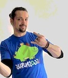

# Startseite

## Kurze Biografie

{ align=left }

Derzeit arbeite ich in der Position des iOS-Lead Entwicklers und Architekten in einem europa weltweiten Plattform-Projekt für die Elektrofahrzeug-Ladeinfrastruktur der Robert Bosch GmbH. Davor war ich als iOS-Entwickler in verschiedenen Projekten der Robert Bosch GmbH sowie beim Start-up myScotty tätig. Vor meiner Anstellung bei Bosch hatte ich die Position des Technischen Direktors in der Videospiel- und Softwarefirma Zeitland media and games GmbH inne.

## Über diese Seite

- :fontawesome-brands-markdown: **Dank `mkdocs` in Markdown**

    Diese Seite nutzt [mkdocs](), eine ursprünglich für Sofware Dokumentationen konzipiertes Projekt.
    Dank mkdocs kann der gesamte Inhalt nahezu software-agnostisch abgelegt werden und wiederverwendet werden.
    

    Diese Website wurde im April 2024 nach Jahren von [Jekyll]() zu mkdocs migriert.

    ---

    [:octicons-arrow-right-24: Zur Dokumentation von mkdocs](https://www.mkdocs.org/user-guide/)

- :octicons-code-of-conduct-24: **Eine Einladung zum Mitmachen**

    Du hast geniale, einfache, kinderfreundliche Rezepte? Du weißt, wie man einen Origami-Todesstern faltet? Du denkst dir, es wäre cool, dich im Schreiben zu üben? Dann mach mit! Gemeinsam macht es mehr Spaß.
    
    Jeder Beitrag lässt sich immer verbessern, verfeinern, und im schlimmsten Fall Fehler korrigieren. Schreib mich an! Ich freue mich darauf.

- :fontawesome-brands-osi: **Public Open Source**

    Ich kann gar nicht anfangen zu beschreiben, wieviel Wissen über und Spaß an der Software-Entwicklung ich einigen wundervollen Open Source Projekten und persönlichen Blogs von anderen Entwickler:innen zu verdanken habe.

    Es versteht sich daher von selbst, diese Seite und ihre Inhalt als Open Source Projekt zur Verfügung zu stellen.

    ---

    [:octicons-arrow-right-24: Zum Repository auf GitHub](https://github.com/flowinho/mkdocs-based-blog/)

- :material-scale-balance: **GPL v3 Lizenz**

    Mein erarbeitetes Wissen, welches hier weitergegeben wird, wurde nur möglich durch andere Menschen, die ihr Wissen der Allgemeinheit zur Verfügung stellten. Aus diesem Grund stelle ich auch meine Inhalte unter der General Public License zur Verfügung.

    ---

    [:octicons-arrow-right-24: Zur Lizenz](https://github.com/flowinho/mkdocs-based-blog/LICENSE)

- :octicons-feed-heart-16: **Für die Drei wichtigsten Menschen in meinem Leben**

    Die Energie und die Motivation, die mich morgens aus dem Bett bringt und die mich durch den Tag führt, verdanke ich den wundervollen, vielseitigen, belehrenden, anstrengenden, liebevollen und einzigartigen Erfahrungen, die ich durch meine Töchter und meine wundervolle Partnerin I.K. machen darf.

